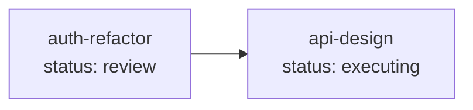

# /moonview:list — Read-Only Task Query

Query task status, details, and relationships. Pure read-only — no files written, no status changes, no git commits.

## Usage

```
/moonview:list                           # List all tasks
/moonview:list <task_module>             # Single task details
/moonview:list --deps                    # Dependency graph (all tasks)
/moonview:list --timeline <task_module>  # Status transition timeline
```

## Modes

### 1. List All Tasks (no arguments)

Output a summary table of all task modules:

| Column | Source |
|--------|--------|
| Module | directory name |
| Title | `.index.json` → `title` |
| Status | `.index.json` → `status` |
| Phase | `.index.json` → `phase` (if non-empty) |
| Progress | `.index.json` → `completed_steps` |
| Type | `.index.json` → `type` |
| Updated | `.index.json` → `updated` |

### 2. Single Task Details (`<task_module>`)

Output all fields from `<module>/.index.json` plus:
- `.summary.md` content (if exists) — condensed context
- `.target.md` first 10 lines — requirements preview
- File listing of task module directory

### 3. Dependency Graph (`--deps`)

Generate a Mermaid diagram showing all task modules and their `depends_on` relationships:



Nodes colored by status: green (complete), blue (executing/review), yellow (planning/re-planning), red (blocked), gray (draft/cancelled).

### 4. Status Timeline (`--timeline <task_module>`)

Extract status transition history from git log:

```
git log --oneline --grep="ai-cli-task(<module>)"
```

Parse commit messages to reconstruct the timeline of status changes with timestamps.

## Execution Steps

1. **Read** `AiTasks/.index.json` — get module listing
2. **For each target module**: read `<module>/.index.json` to get task metadata
3. **If `--deps`**: build dependency graph from all modules' `depends_on` fields; **if `--timeline`**: extract history via `git log --oneline --grep="ai-cli-task(<module>)"`
4. **Format** and print output (table, details, Mermaid graph, or timeline)

## State Transitions

None — `list` is a pure read-only query. No status changes.

## Git

None — `list` does not create any commits.

## .auto-signal

None — `list` does not write `.auto-signal`. It is a utility command that does not participate in the automation loop.

## Notes

- **Pure read-only**: `list` never writes files, never changes status, never creates commits. It is safe to run at any time without side effects
- **No lock required**: Since `list` only reads files, it does not acquire `AiTasks/<module>/.lock`
- **Dependency validation**: The `--deps` mode only visualizes relationships; it does not validate whether dependencies are met (that is `check`'s responsibility)
